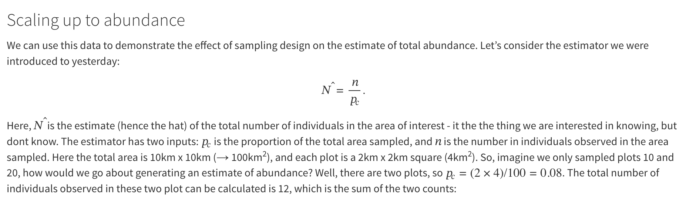
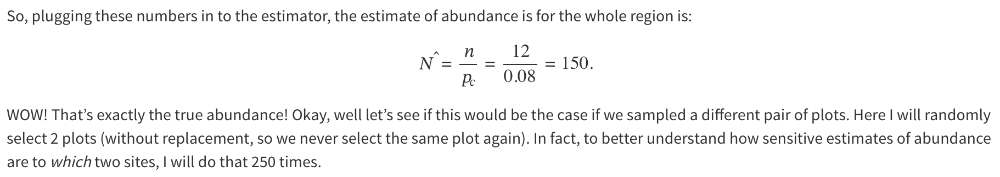

```{r}
#if neccessary, install remotes: install.packages("remotes")
remotes::install_github("https://github.com/chrissuthy/statsecol")
library(statsecol)
data(plotsamp)
```

```{r}
library(tidyverse)
```

```{r}
head(plotsamp)
```

The data describe (simulated) plot sampling data of a population of 300 individuals distributed randomly in space. The left image shows spatial distribution of the 300 individuals, and on the right hand side I have overlayed numbered sampling grids (square plots). Each plot was surveyed, and observers counted all the animals in the plot. So, the resulting data are plot-specific counts, where each row in the data frame relates to a sampling plot and contains the plot ID (Plot), the number of individuals counted (Count), and the coordinates of the grid center (X and Y):

{width="711"}

```{r}
# Sum of the counts of plots 10 amd 20 
(n_10and20 <- sum(plotsamp$Count[plotsamp$Plot %in% c(10,20)]))
```



```{r}
samples <- 250
Nhats_2plot <- numeric(samples)
p_c <- (2*4)/100
for(i in 1:samples){
  tmp_plots <- sample(x = 1:25, # from the plot IDs 1 to 25
                      size = 2, # randomly select 2
                      replace = FALSE) # sample without replacement
  tmp_n <- sum(plotsamp$Count[plotsamp$Plot %in% tmp_plots]) # add the counts from the plots
  Nhats_2plot[i] <- tmp_n / p_c # compute N-hat
} 

mean(Nhats_2plot)
var(Nhats_2plot)

bias <- ((Nhats_2plot - 150))
mean(bias)

mean(Nhats_2plot) - 150
```

```{r}
hist(Nhats_2plot, main="", xlim=c(0,300), 
     col="lightblue", las=1, xlab="Abundance")
abline(v=150, lwd=2, col="blue")
```

**Challenge** :

1.  Repeat the exercise above but with an increasing number of plots sampled: 8, 14, and 20.

2.  Bearing in mind the true number is 150, calculate the bias and variance for each set of samples

    -   *hint*: use the `mean()` and `var()` functions

    -   *hint*: check slides for how to calculate bias

3.  Would you say, based on the results from 1 & 2, that the estimator is *consistent*, why?

```{r}
samples <- 250
Nhats_2plot <- numeric(samples)
p_c <- (8*4)/100
for(i in 1:samples){
  tmp_plots <- sample(x = 1:25, # from the plot IDs 1 to 25
                      size = 8, # randomly select 2
                      replace = FALSE) # sample without replacement
  tmp_n <- sum(plotsamp$Count[plotsamp$Plot %in% tmp_plots]) # add the counts from the plots
  Nhats_2plot[i] <- tmp_n / p_c # compute N-hat
} 

mean(Nhats_2plot)
var(Nhats_2plot)

bias <- ((Nhats_2plot - 150))
mean(bias)
```

```{r}
samples <- 250
Nhats_2plot <- numeric(samples)
p_c <- (14*4)/100
for(i in 1:samples){
  tmp_plots <- sample(x = 1:25, # from the plot IDs 1 to 25
                      size = 14, # randomly select 2
                      replace = FALSE) # sample without replacement
  tmp_n <- sum(plotsamp$Count[plotsamp$Plot %in% tmp_plots]) # add the counts from the plots
  Nhats_2plot[i] <- tmp_n / p_c # compute N-hat
} 

mean(Nhats_2plot)
var(Nhats_2plot)

bias <- ((Nhats_2plot - 150) / 150) * 100
mean(bias)
```


```{r}
samples <- 250
Nhats_2plot <- numeric(samples)
p_c <- (20*4)/100
for(i in 1:samples){
  tmp_plots <- sample(x = 1:25, # from the plot IDs 1 to 25
                      size = 20, # randomly select 2
                      replace = FALSE) # sample without replacement
  tmp_n <- sum(plotsamp$Count[plotsamp$Plot %in% tmp_plots]) # add the counts from the plots
  Nhats_2plot[i] <- tmp_n / p_c # compute N-hat
} 

mean(Nhats_2plot)
var(Nhats_2plot)

bias <- ((Nhats_2plot - 150) / 150) * 100
mean(bias)
```

Yes the estimator is consistent, as it moves closer and closer to the known true value as sample effort increases.


```{r}
# Pre-allocate storage vectors
res_mean <- numeric(25)
res_var  <- numeric(25)
res_bias <- numeric(25)

for (k in 1:25) {
  samples <- 250
  Nhats_2plot <- numeric(samples)
  p_c <- (k*4)/100
  
  for(i in 1:samples){
    tmp_plots <- sample(x = 1:25, size = k, replace = FALSE)
    tmp_n <- sum(plotsamp$Count[plotsamp$Plot %in% tmp_plots])
    Nhats_2plot[i] <- tmp_n / p_c 
  } 
  
  # Store results for the k-th iteration
  res_mean[k] <- mean(Nhats_2plot)
  res_var[k]  <- var(Nhats_2plot)
  res_bias[k] <- mean(Nhats_2plot - 150)
}

res_mean <- as.data.frame(res_mean)
res_bias <- as.data.frame(res_bias)
res_var <- as.data.frame(res_var)

d <- data.frame(res_mean, res_bias, res_var)
```

```{r}
ggplot(data = d, aes(x = seq(1, 25, 1))) +
  geom_line(aes(y = res_mean), color = "red") 

ggplot(data = d, aes(x = seq(1, 25, 1))) +
  geom_line(aes(y = res_bias), color = "blue") 

ggplot(data = d, aes(x = seq(1, 25, 1))) +
  geom_line(aes(y = res_var), color = "green") +
  theme_bw()
```


